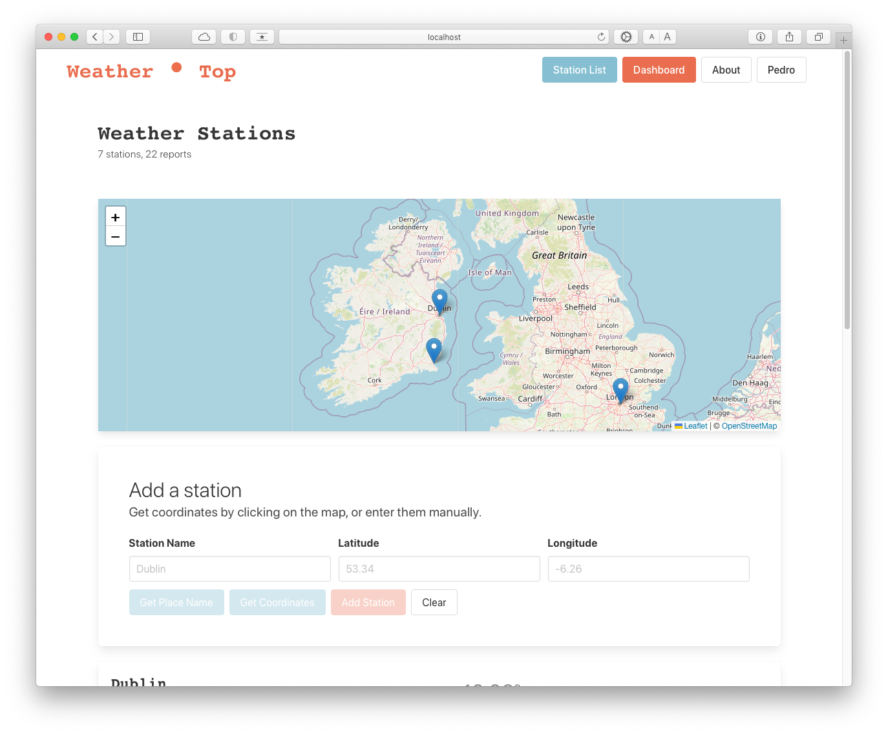
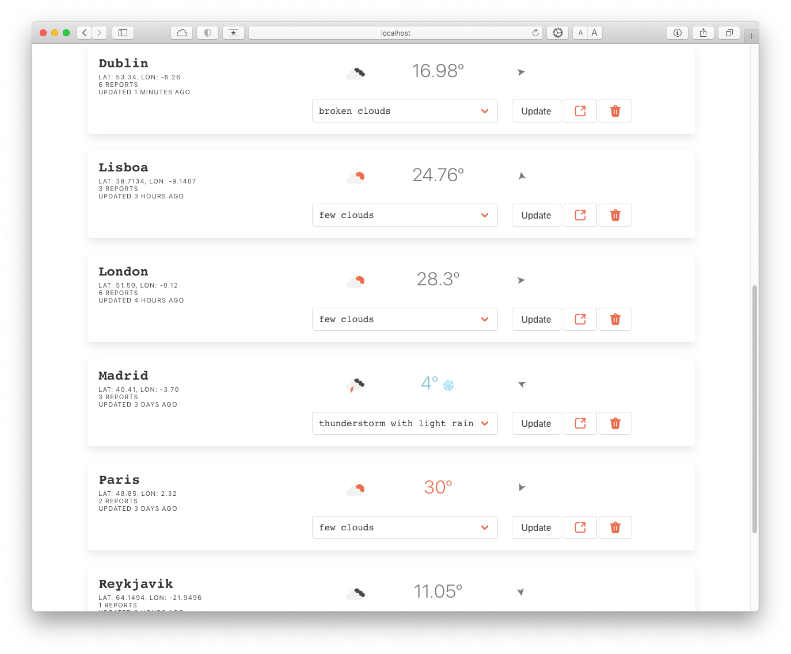
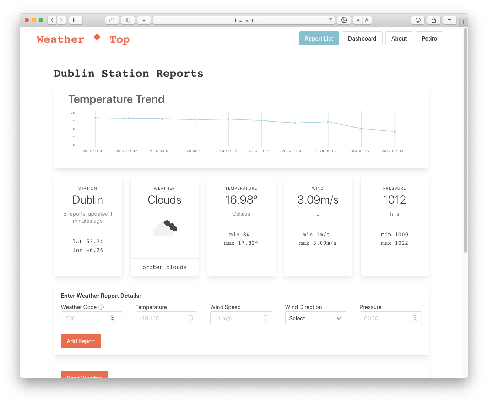
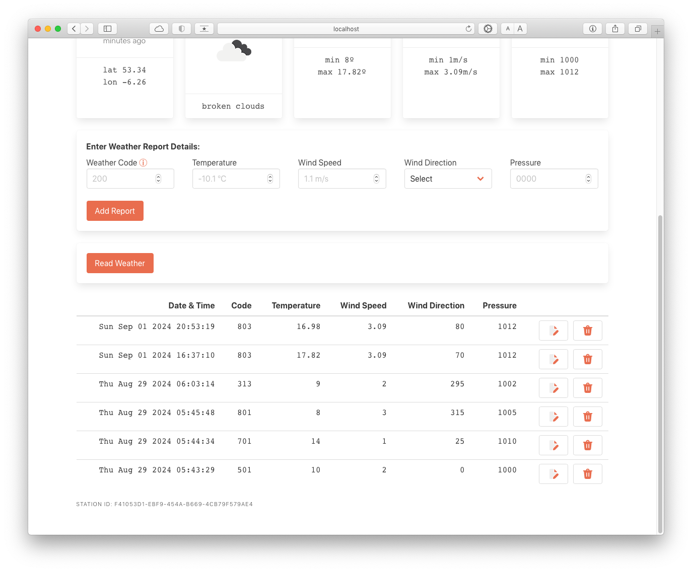
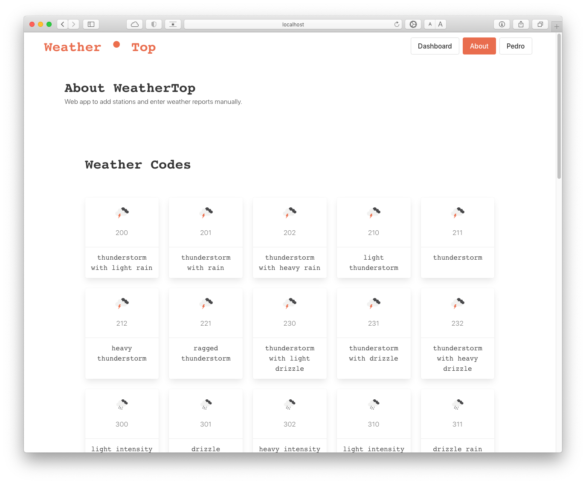
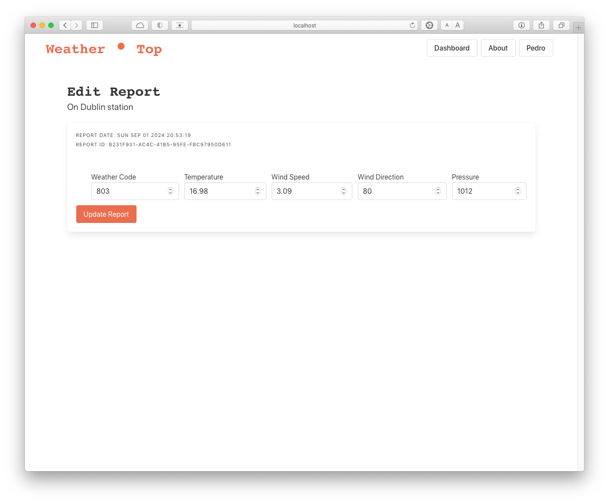
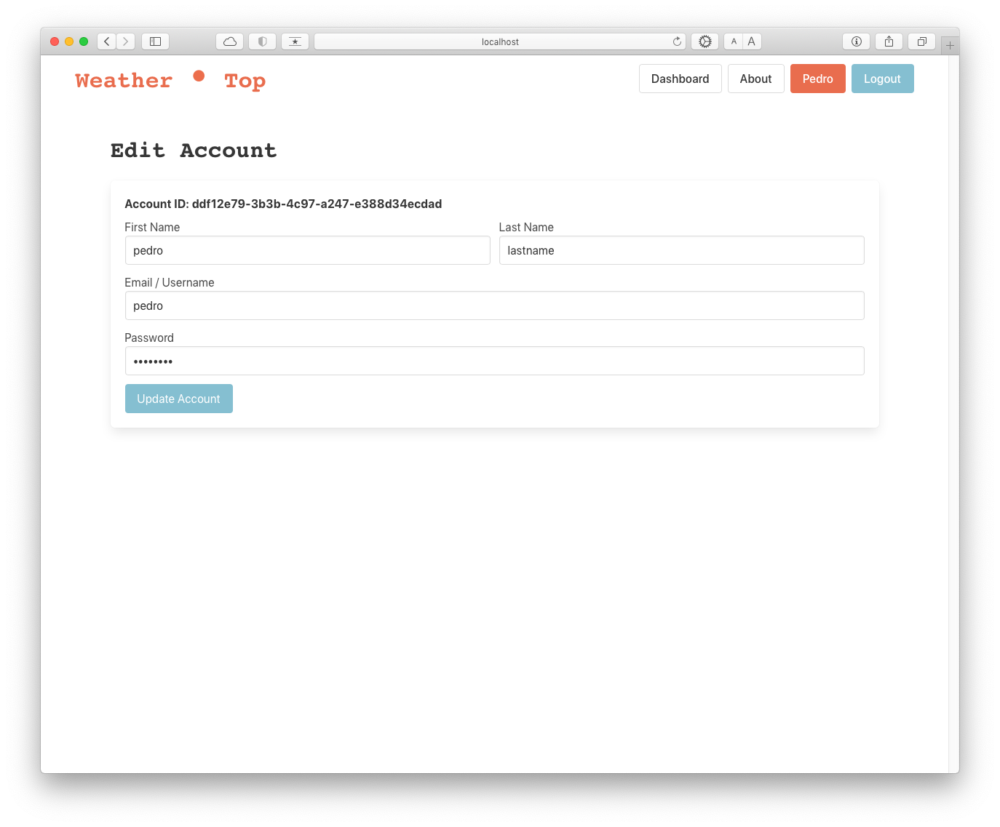
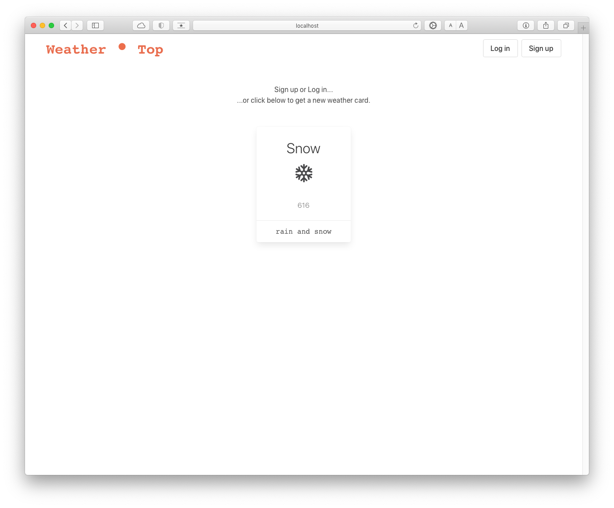

WeatherTop
==========
### Release 4
Web app to add stations and enter weather reports.

---

Author: Pedro Royo  
SETU HDip Computer Science  
August 2024

---

## Usage example:
Create user account, login.  
Add a weather station, (click on map to get the coordinates) 
enter report to the station manually or by external reading.  
Edit reports, edit user details.  
Delete reports, delete stations.

## Features:
### Account
Check for password on login.  
When creating new account, if username exist send to login.  

### Navigation Menu
Firstname shows on Account button when logged in.  
Buttons _Station List_ and _Report List_ links to scroll down.  
This buttons only appear when may be needed.  

### Dashboard

### Map
Shows location of stations with a marker.  
On click gets the coordinates to the form.  
Click on the marker shows popup with station name and temperature for last reading.

### Weather Summary
It shows when each station was last updated. Eg: _2 hours ago_.   
_Pressure_ and _Min / Max_ values hidden in dropdown for a visually light summary.  
Arrow points to wind direction. Alert appears when there is strong wind.  
When freezing, temperature changes colour (blue-green), snowflake alert appears.  
When 30ºC are reached, temperature colour changes to orange. 
Stations ordered by name.

### Temperature Trend
Chart with temperature forecast.

### Station Reports 
Weather data populates 5 cards for a comprehensive station summary.  
Wind direction dropdown.  
Form with min/max help to enter correct values.  
When a station gets deleted, its reports also get deleted.  
Reports ordered by most recent on top.

### Reading
Enter report manually or get the reading by click on _Read Weather_ button

### About
A template generates cards with all the weather codes.  

### Screenshots

